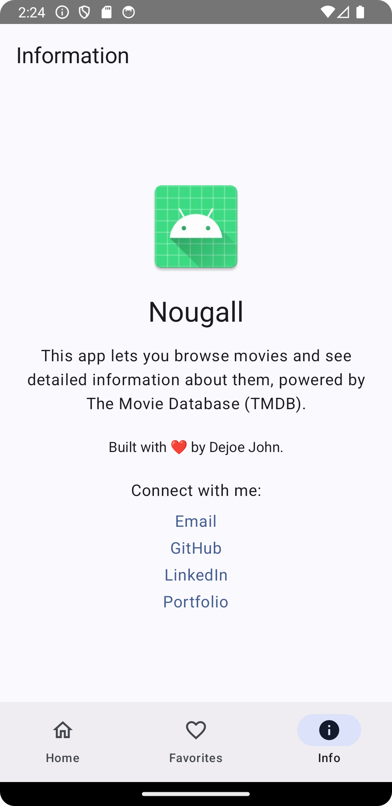

# Nougall 🎬

**Nougall** is an Android app that lets you browse trending movies and view detailed movie information, powered by [The Movie Database (TMDB)](https://www.themoviedb.org/). Built with ❤️ by [Dejoe John](https://dejoe.dev).

---

## ✨ Features

- Browse trending movies
- View movie details and credits
- Save and manage favorite movies
- Offline support using Room database
- Built with Jetpack Compose, Hilt, Room, and Kotlin Coroutines

---

## 📸 Screenshots

   

---

## 🚀 How to Run

Follow these steps to build and run Nougall locally.

### 1. Clone the Repository

```bash
git clone https://github.com/dej0e/nougall.git
cd nougall
```

### 2. Get a TMDB API Key

- Sign up at [The Movie Database (TMDB)](https://www.themoviedb.org/)
- Create an API key from your TMDB account settings

### 3. Add API Key to `local.properties`

Open your `local.properties` file in the root of the project and add:

```ini
TMDB_API_KEY=your_tmdb_api_key_here
```

✅ Do **NOT** commit this file to version control. It's ignored by `.gitignore`.

### 4. Open the Project in Android Studio

- Open Android Studio
- Choose **Open** → Select the Nougall project
- Let Gradle sync

### 5. Run the App

- Connect a device or start an emulator
- Press **Run** in Android Studio

---

## 🧑‍💻 Developer

- **GitHub:** [dej0e](https://github.com/dej0e)
- **LinkedIn:** [Dejoe John](https://linkedin.com/in/dejoejohn)
- **Portfolio:** [dejoe.dev](https://dejoe.dev)
- **Email:** dejoejohn@gmail.com

---
## 💡 Notes

Nougall uses a TMDB API key stored in `local.properties`.

Example `local.properties`:

```ini
sdk.dir=/Users/dejoe/Library/Android/sdk
TMDB_API_KEY=abcd1234
```

---

## ✅ How to Customize

- Add screenshots under the "Screenshots" section:
  ```markdown
  
  ```
- Add your license text if open-sourcing
- Add a "Contributing" section if you'd like contributions

Enjoy exploring movies with Nougall! 🎥
